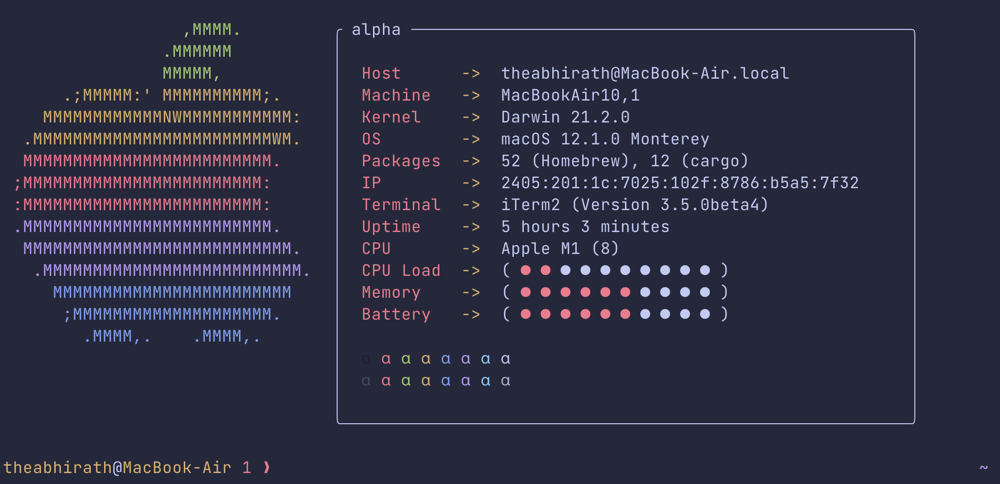

# dotfiles

This repository was created as a store for all my dotfiles, including my zsh configuration and my neovim configuration. The shell was configured with [oh-my-zsh](https://ohmyz.sh) and [typewritten](https://github.com/reobin/typewritten), and the [Tokyo Night](https://github.com/folke/tokyonight.nvim)) theme.

Screenshot of my zsh:

